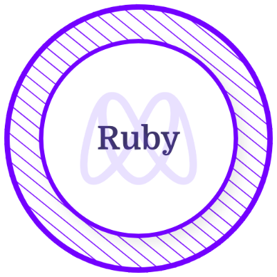

 </a>

  

<h3 align="center">I'm a passionate Full Stack Developer.</h3>

## 🙋‍♂️ About Me

- 🔭 I’m available for work
- 🌱 I’m currently learning **Ruby On Rails.**
- 👯 I’m looking to collaborate on **OpenSource Projects**
- 👨‍💻 All of my projects are available at **[My Portfolio](https://goliviernation.github.io/my-portfolio/)**
- 📫 How to reach me **ogasominali@gmail.com**
- 👯 Open to new job opportunities.
- ⚡ I like 👨‍💻 : Programming | 🎮 : gaming | ☕: Coffee | 🕺: Travel
- I’m looking to collaborate on **Open-Source Projects**
<!-- START NEW SECTION -->
 <!-- CONNECT WITH ME LINKS -->
<h3><a id="user-content-about-me" class="anchor" aria-hidden="true" href="#about-me"><svg class="octicon octicon-link" viewBox="0 0 16 16" version="1.1" width="16" height="16" aria-hidden="true"></a>📫 Connect with me</h3>

    
<!-- START NEW SECTION -->

  <h2 align="center">My Github Profile Trophy</h2>

### Certificates & Licenses 🥇

  &nbsp; &nbsp; &nbsp; &nbsp;   
  

<!-- START NEW SECTION -->

 <h2 align="center">My Github Stats</h2>

|My github statistics|My languages|Streaks|Weekly Coding|
|-|-|-|-|
||||

<!-- START NEW SECTION -->

 
<b>Visitors Count</b>
  

 
 

<!-- START NEW SECTION -->

  
 
<b> Here is a random joke that'll mark your day!</b>

 
 

 
 

 </samp>

 Refresh page to load New joke

 

<!-- START NEW SECTION -->

  
  

<!-- GITHUB ACTIVITY GRAPH -->
<!--  -->

  

